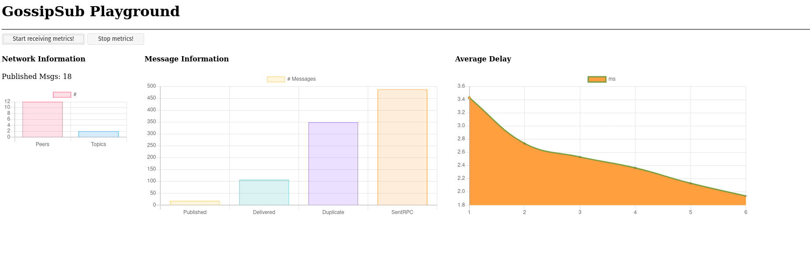

# GOSSIPSUB PLAYGROUND
Simple project to see [GossipSub](https://github.com/libp2p/specs/tree/master/pubsub/gossipsub) in action.
The application runs a libp2p network with a number of publishers and subscribers. Every publisher
node periodically publishes messages into a topic with the same ID of his PeerID, while subscribers
randomly subscribe to one of the available topics, and read the messages sent by the topic's corresponding
publisher.



Traces from every node are collected in the `traces/` directory, and a set of metrics are periodically
generated from the data available. There are two ways of dumping the computed metrics:
* By enabling the `-log` flag, which periodically prints metrics in stdout.
* Or using the `-server` flag that runs an HTTP Server and starts a WebSocket at `ws://127.0.0.1:3000/websocket` so that
anyone can subscribe to the socket and periodically receive updates of the metrics collected in the network.
In the server, along with the websocket, a simple dashboard is provided at `http://localhost:3000` so you can
visually see the evolution of your network metrics.
* Finally, some tests have been performed running a Tracer Node so instead of using a JSONTracer
to collect the local view of each node in the network, you can use a specific node as "aggregator" of
nodes traces. The tracer node will be responsible for collecting and processing the data traced from nodes. 
(The tracer node is not completely
supported by the application, and right now you can only choose to run the node and see how it collects the data
sent to him by all the nodes in the network -no metric computed-. It was something I wanted to test, additional
support and compatibility with the Tracer Node may be added in the future).

### Usage
To run the application you can clone the repo and run:
```
$ go build
$ ./pubsub-playground -pubs <number_publishers> -subs <number_subscribers> -log -server

# Sample execution
$ ./pubsub-playground -pubs 2 -subs 30 -server -log
```

### Why do I need this?
So what is this tool for? What kind of learning can you take from it?
In my case it has
been really fun to implement and play with it, and in your case it can be a great
tool to understand how GossipSub works and behaves with networks of different sizes. 
With GossipSub Playground you will be able to:
* See the type of messages exchanged in a GossipSub network, and the amount of them
required to deliver messages to subscribers.
* Understand how the load of the network behaves according to the number of publishers
and subscribers.
* Realize how the average delay of delivery of messages behaves, and understand how this metrics
changes over time (from boot to stability).
* See the average delay of messages from publishers to subscribers, and the rate of "useful" 
and "control" messages in the system.

### Future Work
There are a bunch of other things that could be added to this tool (and that I wish to be able to try
in the future):
* Dynamic number of publishers and subscribers (so we can dynamically include new nodes to the network).
* More than one topic per node.
* Additional delays and latencies in node connections.
* (And this is a cool one!) With the data collected we could build a heat map to see the exchange of messages between different nodes.

And many more things I may keep adding to this README and (maybe) start implementing in my spare time.
